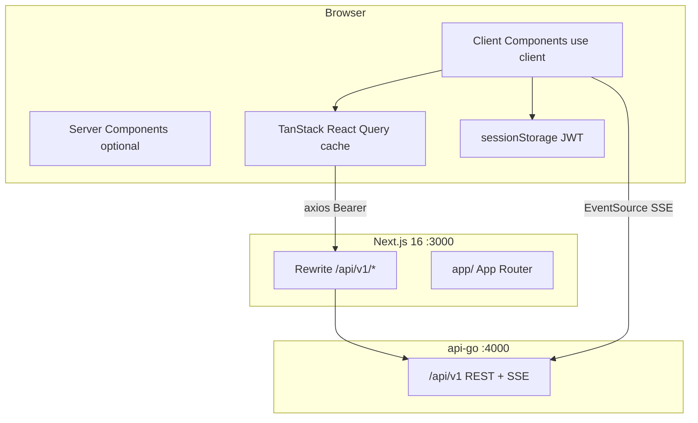
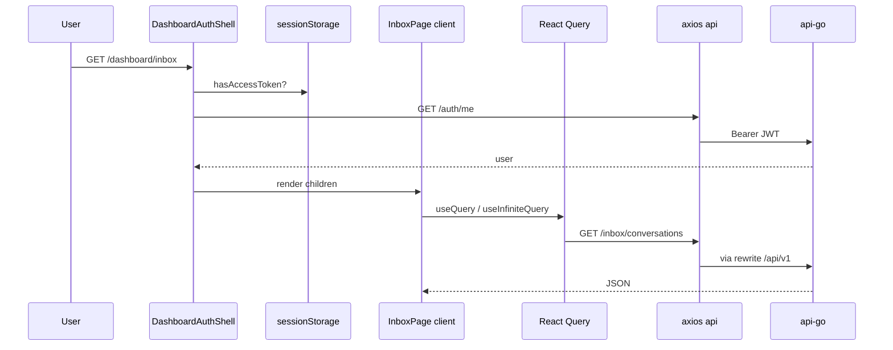
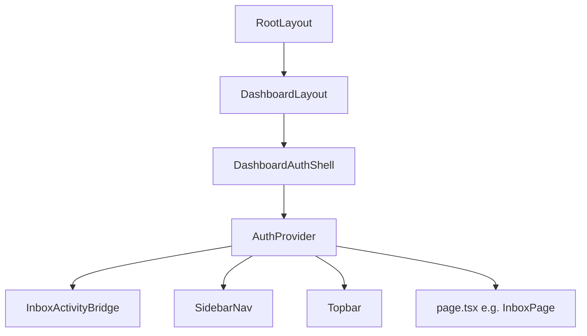
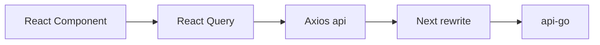

# WABantu Web Frontend — Developer Technical Documentation

> **Audience:** Full-stack developers who may be strong in backend (Go, Node, PHP) but **new to Next.js / React 19**.  
> **Codebase:** `web-frontend/` — Next.js 16 App Router talking to **`api-go/`** only (`/api/v1`, port 4000).  
> **Companion docs:** [README.md](./README.md) · [APP_FLOW_GUIDE.md](./APP_FLOW_GUIDE.md) · [LIMITS_AND_QUOTAS.md](./LIMITS_AND_QUOTAS.md) · **Finance:** [docs/FINANCE_MODULE.md](./docs/FINANCE_MODULE.md) · Backend: [../api-go/DEVELOPER_DOCUMENTATION.md](../api-go/DEVELOPER_DOCUMENTATION.md) · [../api-go/LIMITS_AND_QUOTAS.md](../api-go/LIMITS_AND_QUOTAS.md) · [../api-go/docs/FINANCE_MODULE.md](../api-go/docs/FINANCE_MODULE.md)

**Belum paham React/Next?** Langsung ke **[Bagian 19 — React & Next.js untuk developer baru](#19-react--nextjs-guide-for-developers-new-to-this-stack)**.

Auth aktif: **Bearer JWT di `sessionStorage`** — selaras dengan [README.md](./README.md) dan [APP_FLOW_GUIDE.md](./APP_FLOW_GUIDE.md).

---

# 1. Project Overview

## What this project does

**WABantu Web Frontend** is the operator dashboard and marketing site for the WABantu product:

- Public pages: landing, pricing, privacy, data deletion (Meta compliance).
- Auth: register / login against `api-go`.
- Dashboard: inbox WhatsApp, AI settings, knowledge base, WhatsApp connect, billing, team, catalog, orders, broadcast, import, branches, workflow, super-admin.

There is **no business database in the frontend**. All persistence is via **HTTP API** to Encore `api-go`.

## Main business purpose

Give UMKM owners and staff a **browser UI** to:

1. Configure business profile and AI behavior.
2. Read and reply to WhatsApp conversations in near real time.
3. Manage channels, team, plans, and optional Pro features.

## High-level architecture



## Main technologies

| Layer | Technology |
|-------|------------|
| Framework | **Next.js 16.2** (App Router) |
| UI library | **React 19.2** |
| Language | **TypeScript 5** |
| Styling | **Tailwind CSS v4** + CSS variables (OKLCH) |
| Components | **shadcn/ui-style** (Radix + `cva` + `cn`) |
| HTTP | **Axios** |
| Server state | **TanStack React Query v5** |
| Forms | **react-hook-form** + **Zod 4** |
| Toasts | **Sonner** |
| Icons | **Lucide React** |

## Why Next.js (vs plain React SPA)

| Benefit | How WABantu uses it |
|---------|---------------------|
| File-based routing | `app/dashboard/inbox/page.tsx` → `/dashboard/inbox` |
| API proxy | `next.config.ts` rewrites → no CORS for REST in dev |
| Layout nesting | Shared sidebar for all `/dashboard/*` |
| SEO / marketing | Server-rendered landing (where used) |
| Production | `output: "standalone"` for Docker |

**Compare:** Create React App / Vite SPA would need a separate reverse proxy for `/api/v1`; Next bundles that into dev and deploy config.

---

# 2. Architecture Explanation

## Overall pattern

**Single-page-application feel inside App Router:**

- Almost all **dashboard** pages are **`"use client"`** components that fetch with React Query.
- **No Redux / Zustand** — cache and auth are React Query + Context.
- **Backend = source of truth** — UI reflects API; optimistic updates are rare.

Compare to **Nest + Angular/React admin:** same BFF-less pattern (browser → API directly through rewrite).

## Layers

| Layer | Location | Role |
|-------|----------|------|
| **Routes & layouts** | `app/` | URL structure, nested chrome |
| **Feature UI** | `app/(dashboard)/dashboard/*/page.tsx` | Page-level composition |
| **Shared UI** | `components/` | Sidebar, forms, design system |
| **API clients** | `lib/api/*.ts` | Typed HTTP wrappers |
| **Cross-cutting** | `lib/auth`, `lib/env`, `hooks/` | Session, env, SSE, plan flags |
| **Edge** | `proxy.ts` | Matcher registered; **pass-through** (no auth) |

## Request lifecycle (typical dashboard page)



## Auth architecture (current)

| Concern | Implementation |
|---------|----------------|
| Token storage | `sessionStorage` key `wabantu_access_token` |
| Attach to API | Axios request interceptor → `Authorization: Bearer` |
| Gate dashboard | `DashboardAuthShell` → `authApi.me()` |
| Gate login page | `LoginSessionGate` → redirect if already logged in |
| 401 handling | Axios response interceptor → clear token → `/login?next=` |
| Edge | **`proxy.ts` does NOT check cookies** |

**Implication:** First paint on `/dashboard/*` may show **“Memuat dashboard…”** until `me` returns — unlike old server-cookie model.

## Realtime architecture

`InboxActivityBridge` mounts `useInboxActivityStream`:

- `EventSource` → `GET /api/v1/inbox/stream?access_token=...`
- Dev default: direct `http://localhost:4000/api/v1` (see `lib/env.ts`) because Next rewrite buffers SSE.
- On event → `queryClient.invalidateQueries` for inbox keys.

---

# 3. Folder & File Structure

## Root

| Path | Role |
|------|------|
| `package.json` | Dependencies, scripts (`dev`, `docs:generate`, `build`, `start`) |
| `next.config.ts` | Rewrites, `standalone` output, ngrok `allowedDevOrigins` |
| `proxy.ts` | Next 16 edge hook (no-op auth) |
| `tsconfig.json` | `@/*` path alias → project root |
| `app/globals.css` | Tailwind v4 import + design tokens |
| `.env.example` | Env template |
| `scripts/generate-docs-index.mjs` | Generate Docs Hub index dari semua `.md` di `api-go/` + `web-frontend/` |
| `public/generated-docs/docs-index.json` | Static docs index yang dibaca `/dashboard/docs` |

**No `middleware.ts`** — Next 16 uses `proxy.ts` in this project.

## `app/` — App Router

Parentheses = **route groups** (not in URL):

| Folder | URL examples | Layout |
|--------|--------------|--------|
| `(marketing)/` | `/`, `/pricing`, `/privacy` | Marketing header/footer |
| `(auth)/` | `/login`, `/register` | Split auth layout |
| `(dashboard)/dashboard/` | `/dashboard`, `/dashboard/inbox`, … | `DashboardAuthShell` |

**File conventions:**

| File | Meaning |
|------|---------|
| `page.tsx` | Route UI for that segment |
| `layout.tsx` | Wraps child routes (persists on navigation) |
| `loading.tsx` | Suspense fallback (if present) |
| `error.tsx` | Error boundary (if present) |

### Root layout (`app/layout.tsx`)

- Server Component (no `"use client"`).
- Wraps entire app: fonts (Geist), `ThemeProvider`, `QueryProvider`, `Toaster`.
- Exports `metadata` and `viewport` for SEO/PWA hints.

### Dashboard layout (`app/(dashboard)/layout.tsx`)

```tsx
export const dynamic = "force-dynamic";
export default function DashboardLayout({ children }) {
  return <DashboardAuthShell>{children}</DashboardAuthShell>;
}
```

`force-dynamic` = do not statically cache dashboard HTML at build time.

## `components/`

| Path | Role |
|------|------|
| `providers/query-provider.tsx` | React Query `QueryClient` defaults |
| `providers/auth-provider.tsx` | `useAuth()` context |
| `providers/theme-provider.tsx` | Wrapper (next-themes props passed but provider is pass-through children) |
| `dashboard/dashboard-auth-shell.tsx` | Auth gate + sidebar layout |
| `dashboard/sidebar-nav.tsx` | Navigation + unread badge |
| `dashboard/topbar.tsx` | User menu, logout |
| `dashboard/inbox-activity-bridge.tsx` | SSE hook mount |
| `auth/login-session-gate.tsx` | Redirect logged-in users from login |
| `ui/*` | Button, Input, Card, … (shadcn pattern) |

## `lib/`

| Path | Role |
|------|------|
| `env.ts` | Single source for `NEXT_PUBLIC_*` and server API base |
| `auth/session.ts` | JWT read/write `sessionStorage` |
| `api/client.ts` | Axios instance + interceptors |
| `api/auth.ts`, `inbox.ts`, … | Domain API functions |
| `utils.ts` | `cn()` = clsx + tailwind-merge |
| `business-profile-card-complete.ts` | Dashboard setup checklist helpers |

## `hooks/`

| File | Role |
|------|------|
| `use-plan.ts` | Billing overview → feature flags |
| `use-inbox-activity-stream.ts` | SSE subscription |

---

# 4. Next.js & React-Specific Concepts

## 4.1 Server Components vs Client Components

| | Server Component (default) | Client Component (`"use client"`) |
|---|---------------------------|-------------------------------------|
| Runs on | Node during SSR/SSG | Browser (+ SSR bundle) |
| Can use | `async` component, `fetch`, secrets server-side | `useState`, `useEffect`, browser APIs |
| Cannot use | `useState`, `onClick` | Import server-only modules carelessly |

**WABantu rule of thumb:** dashboard **pages** → `"use client"` because they use React Query and event handlers.

**Example — server root:**

```tsx
// app/layout.tsx — NO "use client"
export default function RootLayout({ children }: { children: React.ReactNode }) {
  return (
    <html lang="id">
      <body>
        <QueryProvider>{children}</QueryProvider>
      </body>
    </html>
  );
}
```

`QueryProvider` is client inside — boundary is at file top of `query-provider.tsx`.

## 4.2 `"use client"` directive

First line of file = this module and its imports become part of **client bundle**.

**Files that must be client in this project:**

- All `lib/api/*` users with hooks (pages).
- `dashboard-auth-shell.tsx`, `auth-provider.tsx`, `login-form.tsx`.
- `hooks/*.ts`.

**Di Vue:** like putting `<script setup>` only in components that need browser APIs — but Next enforces at **file** level.

## 4.3 App Router vs Pages Router (legacy)

This project uses **App Router only** (`app/`). No `pages/` directory.

| Pages Router (old) | App Router (this repo) |
|--------------------|-------------------------|
| `pages/dashboard/inbox.tsx` | `app/(dashboard)/dashboard/inbox/page.tsx` |
| `_app.tsx` global | `app/layout.tsx` |
| `getServerSideProps` | Server Component `async` fetch or client RQ |

## 4.4 Route groups `(name)`

Folder `(dashboard)` **does not** appear in URL:

```
app/(dashboard)/dashboard/inbox/page.tsx  →  /dashboard/inbox
```

Allows different layouts for marketing vs dashboard without `/dashboard` prefix on marketing.

## 4.5 Navigation

| API | Use |
|-----|-----|
| `<Link href="/dashboard">` | Client navigation without full reload |
| `useRouter().replace("/login")` | Programmatic redirect |
| `window.location.assign("/dashboard")` | **Full page load** — used after login to reset all client state |

**Why `assign` after login?** Guarantees fresh shell + token visible to all client modules.

**File:** `app/(auth)/login/login-form.tsx`

## 4.6 `proxy.ts` (Next 16)

Renamed from `middleware.ts`. Runs on **edge** before route handlers.

**Current code:** always `NextResponse.next()` — auth is **not** enforced here.

Edge `proxy.ts` is pass-through only — auth is not checked at edge.

## 4.7 Environment variables

| Prefix | Visible in browser? | Example |
|--------|---------------------|---------|
| `NEXT_PUBLIC_*` | Yes (inlined at build) | `NEXT_PUBLIC_API_URL` |
| No prefix | Server only | `API_BACKEND_URL` |

**Access via `lib/env.ts`** — never scatter `process.env` in components.

```ts
export const env = {
  apiUrl: process.env.NEXT_PUBLIC_API_URL ?? "/api/v1",
  sseApiUrl: /* dev default localhost:4000 */,
  apiUrlInternal: withApiV1Prefix(...),
};
```

## 4.8 API rewrite (BFF-lite)

```ts
// next.config.ts
{ source: "/api/v1/:path*", destination: `${apiBackend}/api/v1/:path*` }
```

Browser calls `http://localhost:3000/api/v1/...` → Next forwards to `http://localhost:4000/api/v1/...`.

**Benefit:** same-origin → no CORS preflight for REST.  
**Exception:** SSE often needs direct API URL (see `env.sseApiUrl`).

---

# 5. API Client Documentation

## 5.1 Axios client (`lib/api/client.ts`)

```ts
export const api = axios.create({
  baseURL: env.apiUrl,  // default "/api/v1"
  timeout: 30_000,
});
```

### Request interceptor

Adds `Authorization: Bearer ${getAccessToken()}` when token exists.

**Compare Express:** attaching `req.headers.authorization` in a custom `fetch` wrapper.

### Response interceptor — envelope unwrap

api-go sometimes returns:

```json
{ "success": true, "data": { ... } }
```

Interceptor replaces `res.data` with inner `data` when `success === true`.

### 401 interceptor & re-auth

- Jika masih ada token (biasanya JWT kedaluwarsa, sesi Redis masih aktif): buka **`SessionReauthDialog`** → `POST /auth/reauth` dengan password → retry request yang gagal.
- Jika re-auth gagal atau tidak ada token: clear session → `/login?next=…`.
- `components/auth/session-reauth-dialog.tsx`, `lib/auth/session-reauth.ts`, `lib/auth/profile-hint.ts` (email untuk label modal).

## 5.2 Domain modules (`lib/api/*.ts`)

Pattern:

```ts
export const inboxApi = {
  async listPage(params): Promise<InboxConversationsPage> {
    const res = await api.get<InboxConversationsPage>("/inbox/conversations", { params });
    return res.data;
  },
};
```

| Module | Base paths |
|--------|------------|
| `auth.ts` | `/auth/register`, `/login`, `/logout`, `/me` |
| `inbox.ts` | `/inbox/conversations`, `.../messages`, `/inbox/stream` (SSE built in hook) |
| `contacts.ts` | `/inbox/contacts` + `priceTypeId`; dropdown tipe harga hanya dari API (tanpa opsi default sintetis) |
| `price-types.ts` | `/business/price-types` — CRUD master tipe harga |
| `business.ts` | `/business/profile` |
| `catalog.ts` | `/business/catalog` (+ `contactId`, `prices[]`, `effectiveSellPrice`); form multi-harga per tipe |
| `catalogImage.ts` | `/business/catalog/import-image/preview` (multipart `files`), `import-image-limits`, `import-image/draft/:jobId/commit` |
| `catalog-image-limits.ts` | Konstanta validasi client (5 MB/file, 5 file, 20 MB total, JPG/PNG/WEBP); jangan set header `Content-Type` manual pada FormData (biarkan axios set boundary) |
| `whatsapp.ts` | `/whatsapp/channels`, `/whatsapp/meta/connect/*` |
| `billing.ts`, `usage.ts`, `payment.ts` | Billing, usage quotas, AI top-up, payments |
| `workflow.ts` | `/workflows` — `list`, `create`, `update` (PATCH), `remove` (DELETE) |
| `orders.ts` | `/orders` + batch; katalog list dengan `contactId`; harga item dari `effectiveSellPrice`; pesanan selesai/batal tersinkron ke finance (backend) |
| `import.ts` | `/import/preview`, `/import/execute`; halaman import menyediakan template CSV/XLSX produk dan execute selalu mengirim `targetTable=business_catalog_item` untuk import katalog produk |
| `admin.ts` | `/admin/tenants` search/pagination, impersonation, plan override, tenant delete |
| `ai-activity.ts` | `/admin/tenant/:id/ai-activity` (+ summary) — super_admin only |

Types are **TypeScript interfaces** mirroring api-go JSON (camelCase).

## 5.3 Docs Hub internal

Route: **`/dashboard/docs`** (menu Platform → Dokumentasi, `super_admin` only).

Source of truth tetap file markdown di repo:

- `../api-go/**/*.md`
- `web-frontend/**/*.md`

Generator:

```bash
npm run docs:generate
```

Script `scripts/generate-docs-index.mjs` menghasilkan `public/generated-docs/docs-index.json` berisi metadata dokumen, heading, anchor, excerpt, dan `searchText`. `predev` dan `prebuild` otomatis menjalankan generator agar Docs Hub ikut update setiap kali README/file `.md` berubah.

Build-time configuration:

| Env | Fungsi |
|-----|--------|
| `API_GO_DOCS_ROOT` | Override path lokal `api-go` saat monorepo path berubah; default `../api-go` |
| `API_GO_DOCS_INDEX_URL` | Ambil remote `docs-index.json` saat `api-go` sudah beda repo/server |

Runtime configuration:

- `/dashboard/docs` punya panel **Sumber Dokumentasi**.
- Superadmin bisa input remote `API_GO_DOCS_INDEX_URL`; nilai disimpan di `localStorage` browser.
- Frontend fetch remote index melalui `/api/docs/remote-index?url=...`, lalu merge dengan local generated index.
- Input `API_GO_DOCS_ROOT` di UI adalah build hint/copy command; browser tidak membaca filesystem lokal karena alasan security.

Fitur UI:

- fuzzy search yang toleran typo ringan dan urutan kata bebas,
- highlight kata pencarian di hasil dan viewer,
- “Poin Relevan” dari heading/section terdekat,
- klik heading/poin untuk lompat ke bagian dokumen.

Karena index ini static JSON, tidak perlu DB/migrasi. Jika nanti butuh AI semantic search, gunakan JSON chunk ini sebagai input retrieval atau vector indexing.

## 5.4 React Query key conventions

| Query key | Purpose |
|-----------|---------|
| `["inbox-unread-summary"]` | Sidebar badge (`INBOX_UNREAD_QUERY_KEY`) |
| `["inbox-conversations", search, unreadOnly]` | Conversation list |
| `["inbox-messages", conversationId, pageSize]` | Message thread |
| `["billing-overview"]` | Plan gating (`use-plan.ts`) |
| `["business-profile"]` | AI settings / overview |
| `["whatsapp-channels"]` | Channel list |

**Invalidation:** after mutations or SSE:

```ts
void qc.invalidateQueries({ queryKey: ["inbox-conversations"] });
```

Prefix match invalidates all queries whose key **starts with** that array.

**Compare SWR:** same mental model; TanStack Query has richer cache APIs.

---

# 6. Data Layer (Frontend)

There is **no ORM or Prisma** in the frontend.

| Concern | Solution |
|---------|----------|
| Fetch | React Query `useQuery` / `useInfiniteQuery` |
| Cache TTL | `staleTime: 30_000` default; inbox uses `Infinity` + SSE invalidate |
| Pagination | Cursor-based `useInfiniteQuery` (inbox) |
| Optimistic UI | Rare; mostly `invalidateQueries` after success |
| Types | TS interfaces in `lib/api/*.ts` |

### Example: inbox infinite list

```tsx
const convosInfinite = useInfiniteQuery({
  queryKey: ["inbox-conversations", debouncedSearch, unreadOnly],
  queryFn: ({ pageParam }) =>
    inboxApi.listPage({ search, unreadOnly, cursor: pageParam, limit: 30 }),
  initialPageParam: undefined,
  getNextPageParam: (last) => last.nextCursor ?? undefined,
});
const conversations = useMemo(
  () => convosInfinite.data?.pages.flatMap((p) => p.items) ?? [],
  [convosInfinite.data],
);
```

**File:** `app/(dashboard)/dashboard/inbox/page.tsx`

---

# 7. Business Logic Flow (UI Side)

## 7.1 Login

1. User submits `login-form.tsx` (Zod + RHF).
2. `authApi.login` → POST `/auth/login` → `setAccessToken`.
3. `window.location.assign(next)` → full navigation to `/dashboard`.
4. `DashboardAuthShell` runs `authApi.me()` → renders app.

## 7.2 Inbox realtime update

1. Webhook saves message on api-go → Redis publish.
2. SSE pushes event to browser.
3. `useInboxActivityStream` invalidates inbox query keys.
4. React Query refetches conversations/messages/unread.

## 7.3 Send staff reply

1. User types in inbox page → `useMutation` → `inboxApi.sendMessage`.
2. On success → invalidate messages + conversations.

## 7.4 WhatsApp OAuth

1. `whatsapp/meta/connect/init` → redirect to Meta OAuth URL.
2. Callback page posts code to `meta/connect/callback`.
3. Invalidate `whatsapp-channels` query.

## 7.5 Plan-gated features

**Dokumentasi kuota & limit:** [LIMITS_AND_QUOTAS.md](./LIMITS_AND_QUOTAS.md) · [api-go/LIMITS_AND_QUOTAS.md](../api-go/LIMITS_AND_QUOTAS.md).

`usePlan()` reads `billing-overview`:

- **`isTrial`:** `hasBroadcast`, `hasWorkflow`, `hasMultiBranch`, `hasCRMLeads` semua `true` (kuota ketat di API).
- Paket berbayar: gate seperti tabel di doc di atas.
- Pages show upgrade UI if false (sidebar may still list links).

**HTTP 429:** toast + banner — `lib/api/rate-limit.ts`, `dashboard-rate-limit-notice.tsx`; `/auth/me` sekali per sesi dashboard.

---

# 8. Authentication & Security

## Token storage: `sessionStorage`

```ts
const TOKEN_KEY = "wabantu_access_token";
sessionStorage.setItem(TOKEN_KEY, token);
```

| Property | Implication |
|----------|-------------|
| Tab-scoped | New tab = not logged in |
| Survives refresh | Same tab OK |
| XSS risk | If attacker runs JS, token readable — mitigate with CSP, sanitize HTML |
| Not HttpOnly | Unlike cookie model — **JS can read token** (required for Axios header) |

## SSE auth

`EventSource` cannot set custom headers → token in query:

```
/inbox/stream?access_token=<JWT>
```

api-go `AuthenticateHTTP` accepts this (see api-go auth docs).

## Role checks

- **Owner-only** actions: buttons disabled or hidden via `user.role === "owner"` (from `useAuth()`).
- **Super admin:** `/dashboard/admin` (konsol platform); tenant menu setelah **Pantau** (`hasTenantDashboardAccess`). Konsol admin mendukung search/pagination tenant, override paket, dan delete tenant permanen dengan konfirmasi schema. `usePlan` tidak memanggil billing overview tanpa konteks tenant. `RequireTenantDashboard` + sidebar grup **Platform** vs menu tenant.

**Note:** Real enforcement is on **api-go** (`tag:owner`); UI checks are UX only.

## Security checklist for new features

- [ ] Never log token or put in URL except SSE path.
- [ ] Do not store JWT in `localStorage` unless product requires cross-tab (we use `sessionStorage` intentionally).
- [ ] Sanitize user-generated content before `dangerouslySetInnerHTML` (avoid; use text nodes).

---

# 9. External Integrations

| System | Integration point |
|--------|-------------------|
| **api-go** | All `lib/api/*` via Axios |
| **Meta OAuth** | Redirect flow from browser (`whatsapp` pages) |
| **Midtrans** | Payment UI in billing (QR URL from API) |

No direct Anthropic/Meta webhook from frontend — all via backend.

---

# 10. Local Development Guide

## Prerequisites

| Tool | Version |
|------|---------|
| Node.js | **18+** (20/22 recommended) |
| api-go | Running on `:4000` |
| Redis | For api-go sessions |

## Commands

```bash
cp .env.example .env.local
npm install
npm run dev    # http://localhost:3000
```

## Env (minimal)

```env
NEXT_PUBLIC_API_URL=/api/v1
API_BACKEND_URL=http://localhost:4000
```

Optional:

```env
NEXT_PUBLIC_SSE_API_URL=http://localhost:4000
```

(Dev also defaults SSE to `:4000` in `lib/env.ts` when unset.)

## Common issues

| Symptom | Cause | Fix |
|---------|-------|-----|
| API 404 | api-go not running | `encore run` |
| Login loop | Token missing / 401 | Check sessionStorage; api-go Redis |
| Inbox not live | SSE blocked | Set `NEXT_PUBLIC_SSE_API_URL` |
| CORS errors | Called `:4000` without CORS | Use `/api/v1` same-origin or configure api-go CORS |
| Wrong backend | `API_BACKEND_URL=3001` | Point to **4000** not Nest |

## Scripts

| Script | Action |
|--------|--------|
| `npm run dev` | Turbopack dev server |
| `npm run build` | Production build |
| `npm run start` | Serve production build |
| `npm run lint` | ESLint |

---

# 11. Deployment & Infrastructure

## Build output

`next.config.ts`:

```ts
output: "standalone",
```

Produces `.next/standalone` for minimal Docker image (see README Docker section).

## Production env

| Variable | Typical prod value |
|----------|-------------------|
| `NEXT_PUBLIC_API_URL` | `/api/v1` (same host) or full public API URL |
| `API_BACKEND_URL` | Internal URL to api-go service |
| `NEXT_PUBLIC_SSE_API_URL` | Public API URL for EventSource |
| `API_URL_INTERNAL` | Server-side fetch if adding RSC data fetching later |

## Node vs Go deploy

Frontend remains **Node process** (`next start`) or static+server — unlike api-go single binary.

---

# 12. Observability

| Tool | Usage |
|------|--------|
| Browser DevTools | Network tab for `/api/v1`, SSE stream |
| React Query Devtools | Not installed by default — can add `@tanstack/react-query-devtools` |
| `console.error` | Sparse; prefer `toast.error` for user-facing failures |
| Next build logs | `npm run build` for type errors |

---

# 13. Technical Debt & Code Quality

| Item | Notes |
|------|-------|
| `AuthProvider` comment says "server-rendered" | Misleading — client `me()` in shell (cosmetic) |
| `ThemeProvider` no-op | Dark mode variables exist in CSS but toggle inactive |
| Dashboard auth client-only | Brief flash "Memuat dashboard…"; no SSR user |
| No E2E tests in repo | Manual QA |
| Plan gating only on pages | Sidebar shows all links |
| `proxy.ts` matcher useless | Could remove or re-add edge checks with Bearer (hard on edge) |

---

# 14. Developer Onboarding Guide

## Read first

1. Dokumen ini bagian 19 (React/Next primer).
2. [APP_FLOW_GUIDE.md](./APP_FLOW_GUIDE.md) — product flows.
3. [../api-go/DEVELOPER_DOCUMENTATION.md](../api-go/DEVELOPER_DOCUMENTATION.md) — API contract.

## Code reading order

1. `lib/env.ts` + `next.config.ts`
2. `lib/auth/session.ts` + `lib/api/client.ts` + `lib/api/auth.ts`
3. `components/dashboard/dashboard-auth-shell.tsx`
4. One simple page: `dashboard/team/page.tsx`
5. Complex: `dashboard/inbox/page.tsx`
6. `hooks/use-inbox-activity-stream.ts`

## Adding a new dashboard page

1. Create `app/(dashboard)/dashboard/my-feature/page.tsx` with `"use client"`.
2. Add `lib/api/my-feature.ts` using `api` from `client.ts`.
3. Add `useQuery` with a namespaced key `["my-feature", ...]`.
4. Add sidebar link in `sidebar-nav.tsx`.
5. If owner-only, check `useAuth().user.role`.
6. Confirm api-go endpoint exists ([ENDPOINT_COMPATIBILITY](../api-go/ENDPOINT_COMPATIBILITY.md)).

---

# 15. Request Flow Mapping

## `GET /dashboard/inbox` (browser)

| Step | Component / file |
|------|------------------|
| 1 | Next routes to `inbox/page.tsx` |
| 2 | `(dashboard)/layout.tsx` → `DashboardAuthShell` |
| 3 | Token? → `authApi.me()` |
| 4 | `AuthProvider` + `InboxActivityBridge` |
| 5 | `InboxPage` mounts |
| 6 | `useInfiniteQuery` → `inboxApi.listPage` → Axios → rewrite → api-go |
| 7 | Parallel: `useQuery` unread summary |
| 8 | SSE `connect()` in hook |

## `POST /auth/login` (browser)

| Step | File |
|------|------|
| Form submit | `login-form.tsx` |
| API | `auth.ts` → `client.ts` |
| Store token | `session.ts` |
| Navigate | `window.location.assign` |

---

# 16. Diagrams

## Component tree (dashboard)



## Data flow



---

# 17. Important Notes

- **Source of truth for auth:** `lib/auth/session.ts` + `dashboard-auth-shell.tsx` (+ README bagian Auth).
- **sessionStorage** means QA must test in same tab after login.
- **SSE** requires api-go Redis + valid JWT; test Network → `inbox/stream` stays open.
- **TypeScript** interfaces in `lib/api` may drift from api-go — fix types when API changes.
- **React 19** + **Next 16** — follow official docs for breaking changes if upgrading.

---

# 19. React & Next.js Guide for Developers New to This Stack

Bagian ini untuk kamu yang biasa **HTML+jQuery**, **Vue**, **Angular**, **PHP Blade**, atau **backend API saja** — belum terbiasa dengan React mental model.

## 19.0 Peta cepat

| Konsep | Di WABantu | Analogi |
|--------|-------------|---------|
| Component | `function InboxPage() { return <motion> }` | Vue SFC / React = function returning UI |
| JSX | HTML-like in TS | Template syntax |
| State | `useState` | `ref()` in Vue |
| Side effect | `useEffect` | `onMounted`, `watch` |
| Global user | `useAuth()` Context | Pinia / Vuex / session singleton |
| Server data | `useQuery` | `useFetch` / RTK Query |
| Props | Function arguments | Vue props |

---

## 19.1 JSX — HTML inside JavaScript

```tsx
return (
  <Card>
    <p className="text-sm text-muted-foreground">Memuat dashboard…</p>
  </Card>
);
```

Rules:

- One root element (or `<>...</>` fragment).
- `className` not `class` (because `class` is reserved in JS).
- `{expression}` embeds JS values.

**File:** `dashboard-auth-shell.tsx` loading state.

---

## 19.2 Components are functions

```tsx
export function DashboardAuthShell({ children }: { children: React.ReactNode }) {
  ...
}
```

- **PascalCase** name = component.
- **Props** = first argument object (destructured).
- **children** = nested JSX between tags.

**Di PHP:** like partial templates receiving `$variables` — but reactive.

---

## 19.3 `useState` — UI that changes over time

```tsx
const [user, setUser] = useState<AuthUser | null>(null);
const [ready, setReady] = useState(false);
```

- `user` = current value.
- `setUser` = schedule re-render with new value.
- **Never mutate** `user.email = 'x'` directly — always `setUser({ ... })`.

**File:** `dashboard-auth-shell.tsx`

**Compare Vue:** `const user = ref(null)` + `user.value = ...`.

---

## 19.4 `useEffect` — run after render

```tsx
useEffect(() => {
  let cancelled = false;
  async function load() {
    if (!hasAccessToken()) {
      router.replace(`/login?next=...`);
      return;
    }
    try {
      const me = await authApi.me();
      if (!cancelled) {
        setUser(me);
        setReady(true);
      }
    } catch {
      if (!cancelled) router.replace(`/login?next=...`);
    }
  }
  void load();
  return () => {
    cancelled = true;  // cleanup on unmount
  };
}, [pathname, router]);
```

**When it runs:** after paint; dependency array `[pathname, router]` → re-run when those change.

**Cleanup:** prevent `setState` on unmounted component (memory leak warning).

**Di Vue 3:** `onMounted(() => { ... })` + `onUnmounted`.

**Common mistake:** missing dependencies → stale closures (eslint `react-hooks/exhaustive-deps`).

---

## 19.5 `useMemo` — expensive derived data

```tsx
const conversations = useMemo(
  () => convosInfinite.data?.pages.flatMap((p) => p.items) ?? [],
  [convosInfinite.data],
);
```

Recompute list only when query data changes — not every keystroke in unrelated state.

**File:** `inbox/page.tsx`

---

## 19.6 `useCallback` — stable function reference

```tsx
const refresh = useCallback(async () => {
  const me = await authApi.me();
  setUser(me);
}, []);
```

Used when passing callbacks to optimized children or Context — **File:** `auth-provider.tsx`.

---

## 19.7 React Context — global without prop drilling

```tsx
const AuthContext = createContext<AuthContextValue | undefined>(undefined);

export function AuthProvider({ children, initialUser }) {
  const [user, setUser] = useState(initialUser);
  return (
    <AuthContext.Provider value={{ user, setUser, refresh, logout }}>
      {children}
    </AuthContext.Provider>
  );
}

export function useAuth() {
  const ctx = useContext(AuthContext);
  if (!ctx) throw new Error("useAuth must be used inside AuthProvider");
  return ctx;
}
```

**Usage in child:**

```tsx
const { user, logout } = useAuth();
```

**Di Nest admin:** often a React Context or Redux for current user — same idea.

---

## 19.8 TanStack React Query — server state cache

### Mental model

| | React `useState` | React Query |
|---|------------------|-------------|
| Data from | User interaction | **API** |
| Stale handling | Manual | `staleTime`, refetch |
| Loading | Manual `loading` flag | `isLoading`, `isFetching` |
| Dedup | None | Same `queryKey` → one request |

### `useQuery` example

```tsx
const unreadSummaryQuery = useQuery({
  queryKey: INBOX_UNREAD_QUERY_KEY,
  queryFn: () => inboxApi.unreadSummary(),
  staleTime: Number.POSITIVE_INFINITY,
  refetchOnWindowFocus: "always",
});
const totalUnread = unreadSummaryQuery.data?.totalUnreadMessages ?? 0;
```

### `useMutation` example

```tsx
const updateContactMut = useMutation({
  mutationFn: ({ contactId, displayName }) =>
    inboxApi.updateContact(contactId, { displayName }),
  onSuccess: () => {
    toast.success("Nama kontak diperbarui");
    qc.invalidateQueries({ queryKey: ["inbox-conversations"] });
  },
  onError: (e) => toast.error(toApiError(e).message),
});
```

Call: `updateContactMut.mutate({ contactId, displayName })`.

**Compare:** calling `axios.post` in click handler + manual `setLoading` — Query centralizes cache updates.

---

## 19.9 Forms: react-hook-form + Zod

```tsx
const schema = z.object({
  email: z.email({ message: "Email tidak valid" }),
  password: z.string().min(1, "Wajib diisi"),
});

const { register, handleSubmit, formState: { errors } } = useForm<FormValues>({
  resolver: zodResolver(schema),
});

const onSubmit = async (values: FormValues) => {
  await authApi.login(values);
  window.location.assign(next);
};
```

- `register("email")` wires input to form state.
- Zod validates before submit — like **class-validator** DTOs on Nest backend.

**File:** `login-form.tsx`

---

## 19.10 TypeScript in the frontend

### Interfaces for API

```ts
export interface InboxMessage {
  id: string;
  direction: "in" | "out";
  author: "contact" | "ai" | "human" | "system";
  body: string | null;  // null = JSON null from API
}
```

### Union types

```ts
status: "open" | "pending" | "closed" | "snoozed";
```

### `as const` query keys

```ts
export const INBOX_UNREAD_QUERY_KEY = ["inbox-unread-summary"] as const;
```

Narrows type to readonly tuple — helps Query typings.

### Optional chaining

```ts
convosInfinite.data?.pages.flatMap(...)
```

**Di Go:** pointer nil checks — `?.` stops if left side null/undefined.

---

## 19.11 Styling: Tailwind + `cn()`

```tsx
<Button className="w-full" variant="default" />
```

```ts
// lib/utils.ts
export function cn(...inputs: ClassValue[]) {
  return twMerge(clsx(inputs));
}
```

- **Tailwind** = utility classes (`flex`, `p-6`, `text-sm`).
- **`cn()`** = merge classes without conflicts (shadcn pattern).

Design tokens in `app/globals.css`:

```css
--background: oklch(...);
--sidebar: ...;
```

---

## 19.12 shadcn/ui pattern (`components/ui/`)

Components wrap **Radix UI** primitives (accessible dialogs, dropdowns) + **CVA** variants:

```tsx
// Simplified pattern
const buttonVariants = cva("inline-flex items-center ...", {
  variants: { variant: { default: "...", outline: "..." } },
});
```

**Not an npm package `@shadcn/ui`** — files are **copied into repo** and editable.

Dialog primitives used on workflow page: `components/ui/dialog.tsx`, `components/ui/alert-dialog.tsx` (delete rule confirmation; requires `@radix-ui/react-dialog`).

---

## 19.13 Custom hooks

```ts
// hooks/use-plan.ts — lihat LIMITS_AND_QUOTAS.md
export function usePlan() {
  const isTrial = data?.subscription?.isTrial ?? false;
  return {
    isTrial,
    planCode: isTrial ? "trial" : planCode,
    hasBroadcast: isTrial || isPaidBusinessOrPro,
    hasWorkflow: isTrial || isPaidBusinessOrPro,
    hasMultiBranch: isTrial || planCode === "pro",
  };
}
```

**Rule:** hooks must start with `use`; only call hooks at top level of React functions.

---

## 19.14 EventSource (SSE) — not WebSocket

```ts
es = new EventSource(url);  // GET only, no custom headers
es.onmessage = (ev) => {
  const p = JSON.parse(String(ev.data));
  if (p?.type === "ping") return;
  invalidate();
};
```

**File:** `use-inbox-activity-stream.ts`

**Why token in URL?** Browser API limitation — same pattern documented in api-go auth.

---

## 19.15 `sessionStorage` vs `localStorage` vs cookies

| Storage | Scope | Used here? |
|---------|-------|------------|
| `sessionStorage` | Per tab | **Yes** — JWT |
| `localStorage` | Persistent all tabs | No |
| HttpOnly cookie | JS cannot read | Removed from FE auth |

---

## 19.16 `"use client"` boundary pitfalls

If you import a client hook in a **Server Component**, build fails:

```
You're importing a component that needs useState...
```

**Fix:** add `"use client"` to page or move logic to child client component.

---

## 19.17 Async: no `async` component body in client

**Wrong:**

```tsx
"use client";
export default async function Page() {  // problematic pattern for client
```

**Right:**

```tsx
"use client";
export default function Page() {
  useEffect(() => { void load(); }, []);
}
```

Server Components **can** be `async` — dashboard pages here avoid that and use React Query instead.

---

## 19.18 Common mistakes (ex-backend devs)

| Mistake | Fix |
|---------|-----|
| Fetch in every render without Query | Use `useQuery` |
| Forget `invalidateQueries` after POST | Cache shows stale data |
| Put secrets in `NEXT_PUBLIC_` | Only public config |
| Use `router.push` after login then wonder state stuck | Use `location.assign` when full reset needed |
| Edit `lib/api` types without checking api-go | Cross-read Encore handlers |
| Expect edge `proxy` to auth | Use shell + token |

---

## 19.19 Latihan

1. Trace login: `login-form.tsx` → `auth.ts` → `client.ts` → `session.ts`.
2. Add `console.log` in `useInboxActivityStream` `onmessage` — kirim WA — lihat invalidate.
3. Open React Query network tab + DevTools → watch same `queryKey` dedupe.
4. Read `sidebar-nav.tsx` — how unread badge subscribes to `INBOX_UNREAD_QUERY_KEY`.

---

## 19.20 Referensi

- [React docs](https://react.dev/learn)
- [Next.js App Router](https://nextjs.org/docs/app)
- [TanStack Query](https://tanstack.com/query/latest/docs/framework/react/overview)
- [Tailwind v4](https://tailwindcss.com/docs)
- Backend contract: [../api-go/DEVELOPER_DOCUMENTATION.md](../api-go/DEVELOPER_DOCUMENTATION.md)

---

*Document aligned with codebase as of Bearer auth + Next 16 `proxy.ts`.*
